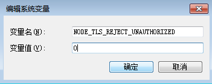

# npm安装cnpm  UNABLE_TO_VERIFY_LEAF_SIGNATURE

    D:\dev\first>npm install -g cnpm --registry=https://registry.npm.taobao.org
    npm ERR! Windows_NT 6.1.7601
    npm ERR! argv "C:\\Program Files\\nodejs\\node.exe" "C:\\Program Files\\nodejs\\node_modules\\npm\\bin\\npm-cli.js" "install" "-g" "cnpm" "--registry=https://registry.npm.taobao.org"
    npm ERR! node v6.10.0
    npm ERR! npm  v3.10.10
    npm ERR! code UNABLE_TO_VERIFY_LEAF_SIGNATURE
    npm ERR! unable to verify the first certificate
    npm ERR!
    npm ERR! If you need help, you may report this error at:
    npm ERR!     <https://github.com/npm/npm/issues>
    npm ERR! Please include the following file with any support request:
    npm ERR!     D:\dev\first\npm-debug.log

解决方法：

	npm config set registry https://registry.npmjs.org
	npm config set strict-ssl false
	npm install -g cnpm --registry=https://registry.npm.taobao.org

# win7 vue-cli ： unable to verify the first certificate

    D:\dev\vue\first>vue init webpack vue_project
    
      This will install Vue 2.x version of the template.
    
      For Vue 1.x use: vue init webpack#1.0 vue_project
    
       vue-cli · Failed to download repo vuejs-templates/webpack: unable to verify the first certificate
       
解决方法：
     
     win7下需要配置环境变量
     NODE_TLS_REJECT_UNAUTHORIZED=0
     
  